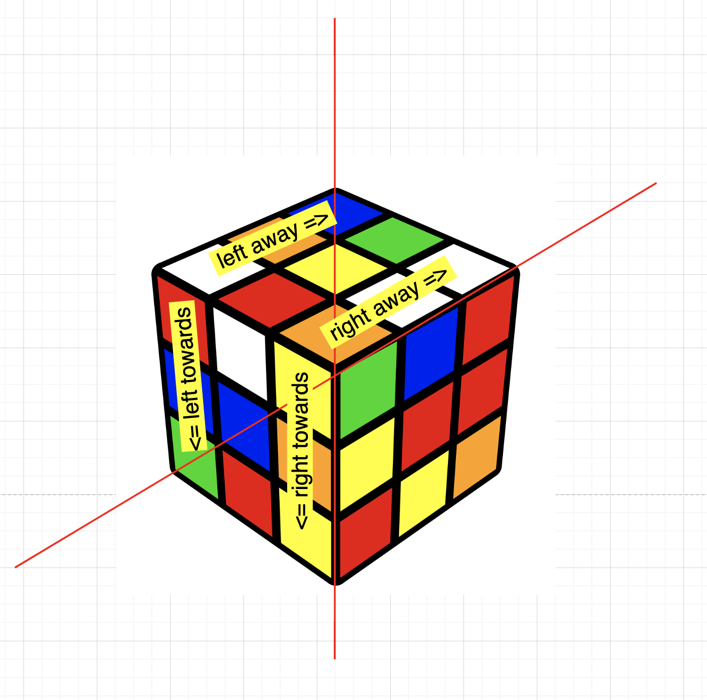

## Usage instructions

> In order to assemble the cube you have to select your front side. After that your cube should remain still and your front side should always be towards you.

### Cube's sides naming convention

---

### Front side and back side instructions
The side with the blue color in the middle should be in front of you and the yellow one should be looking above.

---

### Left side and right side instruction
You either push from you or pull towards you.

---

### Up side and down side instructions
The side with the blue im the middle is still your front side

